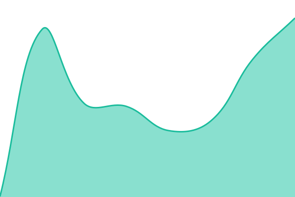
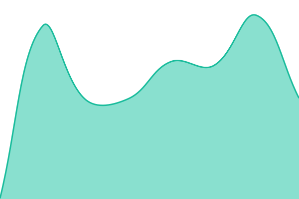
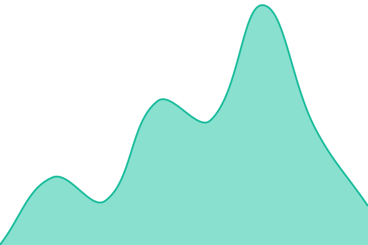

# [📈 Live Status](https://kevinsctx.github.io/recall-status): <!--live status--> **🟧 Partial outage**

This repository contains the open-source uptime monitor and status page for [kevinsctx](https://kevinsctx.github.io/recall-status), powered by [Upptime](https://github.com/upptime/upptime).

With [Upptime](https://upptime.js.org), you can get your own unlimited and free uptime monitor and status page, powered entirely by a GitHub repository. We use [Issues](https://github.com/kevinsctx/recall-status/issues) as incident reports, [Actions](https://github.com/kevinsctx/recall-status/actions) as uptime monitors, and [Pages](https://kevinsctx.github.io/recall-status) for the status page.

<!--start: status pages-->
<!-- This summary is generated by Upptime (https://github.com/upptime/upptime) -->
<!-- Do not edit this manually, your changes will be overwritten -->
<!-- prettier-ignore -->
| URL | Status | History | Response Time | Uptime |
| --- | ------ | ------- | ------------- | ------ |
|  [Recall (production)](https://recallworkspace.com/health) | 🟩 Up | [recall-production.yml](https://github.com/kevinsctx/recall-status/commits/HEAD/history/recall-production.yml) | 

 321ms
     
 | 

<a href="https://kevinsctx.github.io/recall-status/history/recall-production">100.00%</a>
    

|  [Recall (production dependencies)](https://recallworkspace.com/ready) | 🟩 Up | [recall-production-dependencies.yml](https://github.com/kevinsctx/recall-status/commits/HEAD/history/recall-production-dependencies.yml) | 

 270ms
     
 | 

<a href="https://kevinsctx.github.io/recall-status/history/recall-production-dependencies">100.00%</a>
    

|  [Recall (staging)](https://recall.nvestanalytics.com/health) | 🟩 Up | [recall-staging.yml](https://github.com/kevinsctx/recall-status/commits/HEAD/history/recall-staging.yml) | 

 217ms
     
 | 

<a href="https://kevinsctx.github.io/recall-status/history/recall-staging">100.00%</a>
    

|  [Recall assets](https://assets.recallworkspace.com) | 🟥 Down | [recall-assets.yml](https://github.com/kevinsctx/recall-status/commits/HEAD/history/recall-assets.yml) | 

 215ms
     
 | 

<a href="https://kevinsctx.github.io/recall-status/history/recall-assets">7.46%</a>
    

<!--end: status pages-->

[**Visit our status website →**](https://kevinsctx.github.io/recall-status)

## 📄 License

- Powered by: [Upptime](https://github.com/upptime/upptime)
- Code: [MIT](./LICENSE) © [Anand Chowdhary](https://anandchowdhary.com)
- Data in the `./history` directory: [Open Database License](https://opendatacommons.org/licenses/odbl/1-0/)
